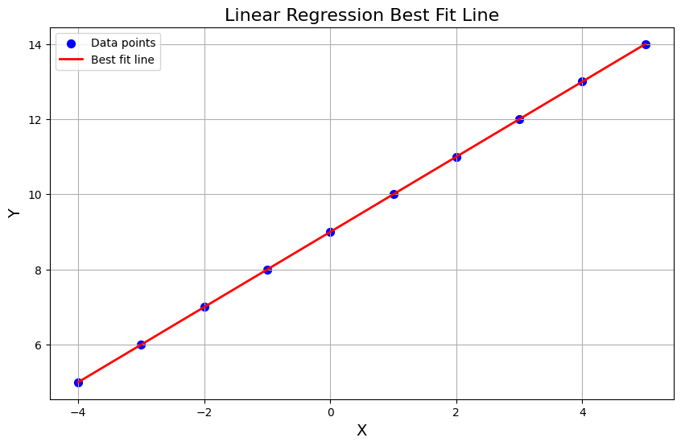

<p align="center">
  <a href="#">
    
    
    
    
    
    
    
    
    
    
  </a>
</p>

# **Train Simple Neural Network with TensorFlow**


## **Overview**
Back on April 16, 2024 I attended the lecture "*Mastering Unsupervised Learning and ANN Basics: An Overview*" by Bangkit Academy 2024, the lecture was held by Instructor [Rahmat Fajri](https://github.com/rfajri27). Our Instructor gave us a challenge to solve the problem by building a neural network model using TensorFlow and Keras. The problem is to predict the output of the given input X and Y array. The input X and Y array are given as follows:

```python
# Defining the input array 'X'
X = np.array([-4.0, -3.0, -2.0, -1.0, 0.0, 1.0, 2.0, 3.0, 4.0, 5.0], dtype=float)

# Defining the output array 'Y'
Y = np.array([5.0, 6.0, 7.0, 8.0, 9.0, 10.0, 11.0, 12.0, 13.0, 14.0], dtype=float)
```

## **Objective**

I challenged myself to solve the problem by building a simple neural network model using TensorFlow and Keras that could solve this problem by at least 0.05% loss and could achieve this target within 10 epochs. 

## **Model Architecture**

The model architecture that I used to solve this problem is as follows:

```py
# Defining the model architecture
model = tf.keras.Sequential(
        [
            # Input layer with 1 input feature
            tf.keras.layers.InputLayer(shape=[1]),
            # First hidden layer with 16 neurons and ReLU activation function
            tf.keras.layers.Dense(units=16, activation="relu"),
            # Second hidden layer with 8 neurons and ReLU activation function
            tf.keras.layers.Dense(units=8, activation="relu"),
            # Output layer with 1 neuron
            tf.keras.layers.Dense(units=1),
        ]
    )
```

The model summary is as follows:

| Layer (type) | Output Shape | Param # |
| --- | --- | --- |
| hidden_layer1 (Dense) | (None, 16) | 32 |
| hidden_layer2 (Dense) | (None, 8) | 136 |
| output_layer (Dense) | (None, 1) | 9 |

The model is compiled using the Adam optimizer with a learning rate of 0.03 and the huber loss function. The model is trained using the input X and output Y array for 100 epochs. The model training history is as follows:

| Epoch | Loss | MSE |
| --- | --- | --- |
| 1 | 0.1643 | 0.3293 |
| 2 | 0.6034 | 1.4849 |
| 3 | 1.5841 | 4.5783 |
| 4 | 0.0666 | 0.1333 |
| 5 | 0.2100 | 0.4264 |
| 6 | 0.1347 | 0.2695 |
| 7 | 0.5594 | 1.2378 |
| 8 | 0.9205 | 2.1279 |
| 9 | 0.1040 | 0.2080 |

Training was stopped early at epoch 9 as the loss reached the threshold of 0.05. The final loss and MSE at this point were 0.0480 and 0.0960 respectively.

## **Key Takeaways**

The model was able to solve the problem by achieving a loss of 0.0480 and MSE of 0.0960 within 9 epochs. The model was able to achieve the target of 0.05% loss within 10 epochs. The model architecture used was able to solve the problem effectively and efficiently.

I learned that for this simple problem, a simple neural network model with 2 hidden layers with 16 and 8 neurons respectively was able to solve the problem effectively. The model was able to learn the relationship between the input X and output Y array and predict the output Y array effectively.

## **Linear Algebra Equation**

The linear algebra equation that represents the model is as follows:

$$ y = 1.0x + 9.0 $$

Where $y$ is the output array and $x$ is the input array, the model was able to learn this relationship effectively and predict the output array effectively.

## **Linear Regression plot**

The linear regression plot of the model is as follows:



The plot shows the relationship between the input X and output Y array. The model I built was able to learn this relationship precisely.

## **Conclusion**

In conclusion, this project has demonstrated the power and simplicity of neural networks in solving regression problems. By using a simple architecture with just two hidden layers, we were able to train a model that accurately predicts the output array from the input array, achieving a low loss of 0.0480 and MSE of 0.0960 within just 9 epochs.

This project has not only reinforced my understanding of neural networks, but also the importance of setting clear objectives and targets. The goal of achieving a loss of 0.05% within 10 epochs guided the design and training of the model, leading to an efficient and effective solution.

Moving forward, I am excited to apply the knowledge and skills gained from this project to more complex problems and datasets. I am confident that with the power of TensorFlow and Keras, I will be able to tackle these challenges and continue to grow as a machine learning practitioner.

Thank you for taking the time to review this project. I welcome any feedback or suggestions for improvement.
